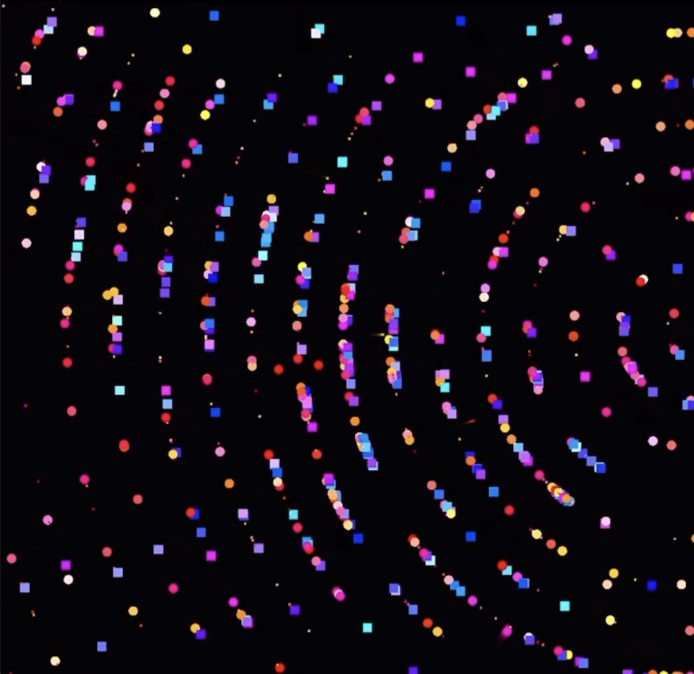
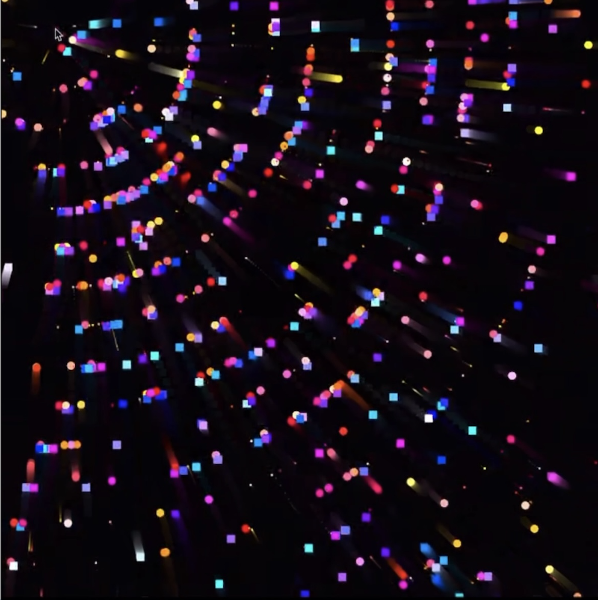

# week8
## Imaging Technique Inspiration
yhan0830_week8_quiz

Selected techniques: 
particle animation and mouse interactive animation

Why choose this technique: Using particle animation can make static images move and give them vitality. It can also enhance the user interaction experience. Provide dynamic visual presentation. By moving the mouse to change the center of the image, for technical purposes, it can bring a dynamic display effect to the reference works (Mondrian) selected by our subsequent group.

## Coding Technique Exploration

This code uses HTML5 Canvas and JavaScript to implement a particle effect, where the motion of particles can be dynamically controlled by mouse position. This interactive approach not only enhances the user experience, but also allows for real-time changes in visual performance based on user actions, making it very suitable for creating dynamic and interactive visual effects. By utilizing Canvas drawing and animation features, it is possible to effectively render a large number of particles without sacrificing performance, which is crucial for interactive designs that require high-performance real-time feedback.

[Link of code](https://blog.csdn.net/chenzhi0122/article/details/131195632
)
